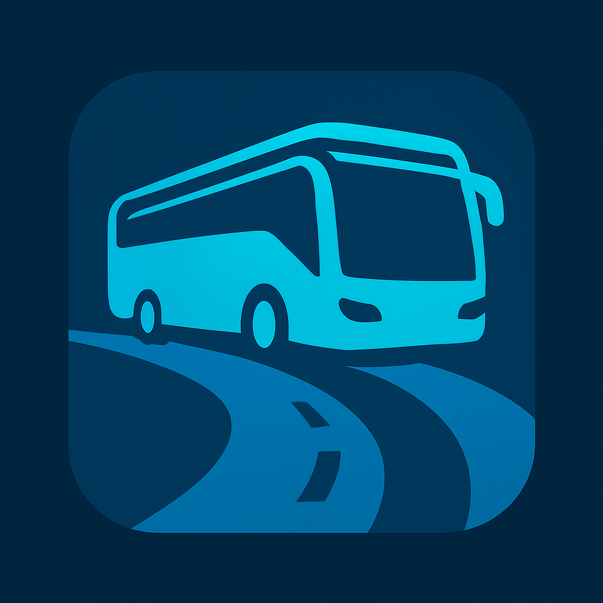

Enterprise Bus Transportation Management System (inspirace FlixBus)

Téma práce:
Cílem semestrální práce je návrh a implementace podnikového informačního systému pro autobusovou dopravní společnost. Naším cílem je vyvijet vicevrstvou aplikace a zvýšit schopnosti a znalosti při návrhu a implementaci složitějšího informačního systému.
Aplikace bude implementována jako čistě backendová REST API služba bez grafického rozhraní, a otestovana pomocí unit-testu a postmanu.

Systém bude fungovat jenom jako online platforma bez poboček. Uživatel zadává konkrétní parametry a počet cestujících osob, system zobrazí seznam dostupných jizd, uživatel zvoli cestu, systém zobrazí seznam volnych sedadel, uživatel zvoli sedadlo, a provede platbu.
Hlavní funkce systému:
Správa uživatelů a rolí - registrace, autentizace (JWT), autorizace podle role.
Správa autobusů a tras - evidence vozidel, přidělení řidičů, definice tras a vzdáleností.
Plánování jízd - vytváření a správa jednotlivých spojů s určením času odjezdu, příjezdu a kapacity.
Vyhledávání spojů - filtrování podle města, data, ceny, dostupnosti.
Rezervace a prodej jízdenek - nákup a zrušení jízdenek zákazníkem.
Řidičský modul - přehled přidělených spojů a cestujících.
Administrativní modul - reporty o vytížení spojů, prodejích a tržbách.
Bezpečnostní vrstva - role-based přístup pomocí Spring Security (JWT).
Cílovou skupinou uživatelů je administrátoři,řidiče, zakazniky(cestující)

Role:
Admin - hlavní role ktera spravuje a muže manipulovat s celym systemem, upravovat jine role, spravují trasy, autobusy, řidiče, a zrušovat objednavky uživatelům.

User - je uživatel který používá tento systém pro hledání, filtrování jizd podle zadaných parametrů, nakupu jizdenky a vyberu konkretniho sedadla ve autobusu, hradit rezervaci platbou, prohlížet své uplatněné a vystavené jízdenky, prohlížet detailní informace své konkrétní jízdenky, může zrušit jízdenku a vrátit peníze nejpozději za 15 min do začátku cesty.
Pokud uživatel nepřihlášený, systém umožňuje prohlížet dostupná spojení podle nastavených filtru (odkud, kam, datum, počet cestujících). Při pokusu rezervace (výběru konkrétního spojení) uživatel je požádán o přihlášení / založení účtu.

Driver - může upravovat a sledovat seznam cestujicih.
