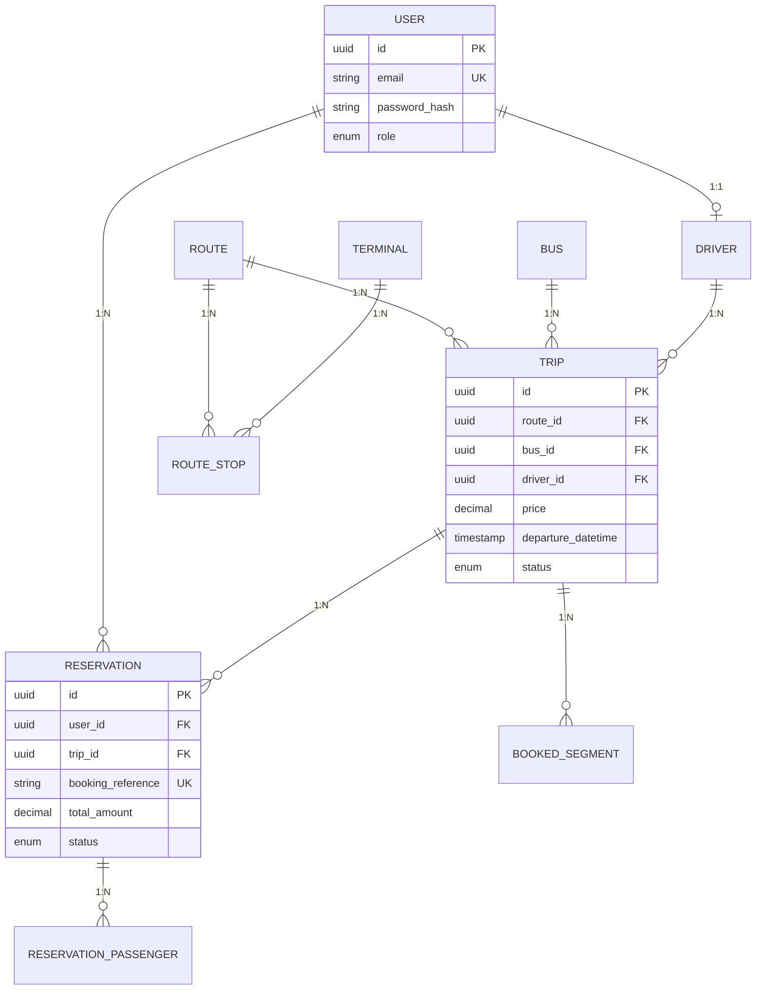

# 📋 Zpráva o projektu Bus2Holiday

> **Semestrální práce z předmětu Enterprisové aplikace (EAR)**
> **Akademický rok:** 2025/2026

---

## 📑 Obsah

- [Popis aplikace](#-popis-aplikace)
- [Struktura aplikace](#-struktura-aplikace)
- [Instalační návod](#-instalační-návod)
- [Zkušenosti získané během projektu](#-zkušenosti-získané-během-projektu)
- [Závěr](#-závěr)

---

## 🚍 Popis aplikace

**Bus2Holiday** je backendový informační systém pro správu mezinárodní autobusové dopravy, inspirovaný platformou FlixBus. Aplikace poskytuje kompletní REST API pro rezervaci jízdenek, správu autobusů, tras, řidičů a uživatelů.

### Hlavní funkcionality

<table>
<tr>
<td width="33%">

#### 👤 Pro zákazníky (USER)
- ✅ Registrace a JWT autentizace
- 🔍 Vyhledávání spojů
- 🎫 Rezervace jízdenek
- 💺 Výběr sedadel
- 💳 Platební operace

</td>
<td width="33%">

#### 🚗 Pro řidiče (DRIVER)
- 📋 Přehled přidělených jízd
- 👥 Seznam cestujících
- ⏰ Správa dostupnosti
- 🔔 Notifikace změn

</td>
<td width="33%">

#### 🔐 Pro administrátory (ADMIN)
- 👥 Správa uživatelů a rolí
- 🚌 Správa autobusového parku
- 🗺️ Definice tras a zastávek
- 📊 Statistiky a tržby

</td>
</tr>
</table>

### 🛠️ Technologický stack

| Kategorie | Technologie | Verze |
|-----------|-------------|-------|
| **Framework** | Spring Boot | 3.5.6 |
| **Databáze** | PostgreSQL | 15+ |
| **ORM** | Spring Data JPA / Hibernate | - |
| **Bezpečnost** | Spring Security + JWT | 0.12.3 |
| **Migrace** | Flyway | - |
| **Testování** | JUnit 5 + Testcontainers | - |
| **Build Tool** | Maven | - |
| **Java** | OpenJDK | 21 (LTS) |
| **Kontejnerizace** | Docker + Docker Compose | - |

---

## 🏗️ Struktura aplikace

Aplikace dodržuje klasickou **vícevrstvou (multi-tier) architekturu** enterprise aplikací:

```
bus2holiday/
├── 🎮 controller/          # REST API endpointy (7 controllerů)
│   ├── AuthController
│   ├── BusController
│   ├── DriverController
│   ├── ReservationController
│   ├── RouteController
│   ├── UserController
│   └── DebugController
│
├── ⚙️ service/             # Business logika (7 služeb)
│   └── [BusService, DriverService, ReservationService, ...]
│
├── 💾 dao/                 # Data Access Objects (11 repositářů)
│   └── [BusRepository, UserRepository, TripRepository, ...]
│
├── 📊 model/               # JPA entity (17 entit)
│   ├── User, Driver, Bus
│   ├── Route, RouteStop, Terminal
│   ├── Trip, Reservation
│   └── enums/ (UserRole, BusStatus, TripStatus, ...)
│
├── 📦 dto/                 # Data Transfer Objects (20 DTO)
│   └── mapper/            # MapStruct mappery
│
├── 🔒 security/            # Bezpečnostní vrstva (7 tříd)
│   ├── JwtTokenProvider
│   ├── UserDetailsServiceImpl
│   └── model/ (UserDetails, LoginStatus)
│
├── ⚠️ exception/           # Vlastní výjimky (6 tříd)
└── 🔧 config/              # Spring konfigurace (3 třídy)
```

### 📐 Datový model - Klíčové vztahy



### 🔌 REST API architektura

Všechny endpointy vrací JSON a dodržují RESTful konvence:

| Metoda | Účel | Příklad |
|--------|------|---------|
| `GET` | Čtení dat | `GET /api/buses` |
| `POST` | Vytvoření | `POST /api/buses` |
| `PUT` | Úplná aktualizace | `PUT /api/buses/{id}` |
| `PATCH` | Částečná aktualizace | `PATCH /api/buses/{id}/status` |
| `DELETE` | Smazání | `DELETE /api/buses/{id}` |

> [!NOTE]
> Autorizace je řešena pomocí JWT tokenů v hlavičce `Authorization: Bearer <token>`

---

## 📥 Instalační návod

### Předpoklady

- ☕ **JDK 21** nebo vyšší
- 📦 **Maven 3.9+**
- 🐘 **PostgreSQL 15+** (nebo Docker)
- 🔧 **Git**

### 📝 Krok 1: Klonování repositáře

```bash
git clone <repository-url>
cd bus2holiday
```

### 🐳 Krok 2: Spuštění databáze

**Varianta A - Docker (doporučeno):**

```bash
docker-compose up -d postgres
```

Přihlašovací údaje:
- 🗄️ Databáze: `appdb`
- 👤 Uživatel: `app`
- 🔑 Heslo: `app`
- 🔌 Port: `5432`

**Varianta B - Lokální PostgreSQL:**

```sql
CREATE DATABASE bus2holiday;
CREATE USER thera WITH PASSWORD '1702';
GRANT ALL PRIVILEGES ON DATABASE bus2holiday TO thera;
```

### ⚙️ Krok 3: Konfigurace aplikace

Upravte soubor `src/main/resources/application.properties`:

```properties
# Pro Docker:
spring.datasource.url=jdbc:postgresql://localhost:5432/appdb
spring.datasource.username=app
spring.datasource.password=app

# Nebo pro lokální PostgreSQL:
spring.datasource.url=jdbc:postgresql://localhost:5432/bus2holiday
spring.datasource.username=thera
spring.datasource.password=1702

# JWT konfigurace
jwt.secret=404E635266556A586E3272357538782F413F4428472B4B6250645367566B5970
jwt.expiration=86400000
```

### 🚀 Krok 4: Kompilace a spuštění

```bash
# Kompilace projektu
mvn clean install

# Spuštění aplikace
mvn spring-boot:run
```

✅ Aplikace poběží na **http://localhost:8081**

### 📊 Krok 5: Inicializace testovacích dat

Aplikace automaticky vytvoří schéma a naplní testovací data pomocí `data.sql`:

**Testovací účty:**

| Email | Heslo | Role |
|-------|-------|------|
| admin@bus2holiday.com | `password123` | 🔐 ADMIN |
| john@example.com | `password123` | 👤 USER |
| jane@example.com | `password123` | 👤 USER |
| driver1@bus2holiday.com | `password123` | 🚗 DRIVER |
| driver2@bus2holiday.com | `password123` | 🚗 DRIVER |

**Testovací data zahrnují:**
- ✅ 5 uživatelů (admin, zákazníci, řidiči)
- 🏢 5 terminálů (Praha, Brno, Vídeň, Budapešť, Bratislava)
- 🚌 4 autobusy
- 🗺️ 5 tras s zastávkami
- 🎫 3 naplánované jízdy

### 🧪 Krok 6: Testování API

**Přihlášení (získání JWT tokenu):**

```bash
curl -X POST http://localhost:8081/api/auth/login \
  -H "Content-Type: application/json" \
  -d '{
    "email": "admin@bus2holiday.com",
    "password": "password123"
  }'
```

**Odpověď:**
```json
{
  "accessToken": "eyJhbGciOiJIUzI1NiIsInR5cCI6IkpXVCJ9...",
  "tokenType": "Bearer",
  "expiresIn": 86400000
}
```

**Příklad - seznam autobusů:**

```bash
curl -X GET http://localhost:8081/api/buses \
  -H "Authorization: Bearer <your-token>"
```

### 📮 Testování pomocí Postman

V adresáři `postman/` najdete připravenou kolekci s ukázkovými požadavky.

### 🐋 Spuštění pomocí Docker Compose

Pro kompletní kontejnerizované prostředí:

```bash
docker-compose up --build
```

### ✅ Spuštění testů

```bash
# Unit + integrační testy s Testcontainers
mvn test
```

> [!TIP]
> Testcontainers automaticky stáhne PostgreSQL Docker image a spustí izolované testy.

---

## 💡 Zkušenosti získané během projektu

### 4.1 Použité technologie a jejich hodnocení

#### ✅ Spring Boot 3.5.6 (Java 21)

**Výhody:**
- ✔️ Výborná integrace všech Spring modulů
- ✔️ Auto-konfigurace šetří čas
- ✔️ Spring Boot Actuator pro monitoring
- ✔️ Virtual Threads (Java 21) pro lepší škálovatelnost

**Nevýhody:**
- ⚠️ Novější verze → méně řešení na StackOverflow
- ⚠️ Některé knihovny ještě nejsou plně kompatibilní

> [!NOTE]
> **Závěr:** Moderní volba, která se osvědčila. Java 21 LTS je perfektní pro dlouhodobé projekty.

#### ✅ JWT autentizace (io.jsonwebtoken)

**Výhody:**
- ✔️ Stateless autentizace (snadná škálovatelnost)
- ✔️ Token obsahuje všechny potřebné informace
- ✔️ Žádné session → jednodušší deployment

**Nevýhody:**
- ⚠️ Nutnost řešit obnovu tokenů (refresh tokens)
- ⚠️ Složitější revokace tokenů
- ⚠️ Kompromitace tajného klíče = všechny tokeny zneplatněny

**Zkušenost:** Implementace JWT filtru byla náročnější, než jsem čekal - musel jsem řešit správné pořadí Security filter chain.

#### ✅ Spring Data JPA + Hibernate

**Výhody:**
- ✔️ Minimální boilerplate kód
- ✔️ Named Queries pro čitelnost
- ✔️ Automatické generování schématu

**Nevýhody:**
- ⚠️ N+1 problém u lazy loading → `@EntityGraph`
- ⚠️ Cyklické reference při JSON serializaci → `@JsonIgnore`

> [!CAUTION]
> **Neočekávaný problém:** `ObjectOptimisticLockingFailureException` při 1:1 vztahu `User-Driver` kvůli špatnému použití `@MapsId`. Řešil jsem odstranění manuálního nastavení `userId` v setterech.

#### ✅ Flyway (Database Migrations)

**Výhody:**
- ✔️ Verzovatelné schema změny
- ✔️ Automatické aplikování migrací

**Nevýhody:**
- ⚠️ Konflikt s `spring.jpa.hibernate.ddl-auto=create`
- ⚠️ Circular dependency s `entityManagerFactory`

**Řešení:** Ve vývojovém prostředí jsem Flyway vypnul a používám pouze `data.sql`.

#### ✅ Testcontainers

**Výhody:**
- ✔️ Reálná PostgreSQL databáze v testech
- ✔️ Reprodukovatelné prostředí
- ✔️ Izolace mezi testy

**Nevýhody:**
- ⚠️ Pomalejší start testů
- ⚠️ Vyžaduje běžící Docker daemon

#### ✅ Lombok

**Výhody:**
- ✔️ Eliminace getterů/setterů
- ✔️ Šetří stovky řádků kódu

**Nevýhody:**
- ⚠️ IntelliJ IDEA plugin občas selhává
- ⚠️ Debugging je komplikovanější

### 4.2 Neočekávané problémy a jejich řešení

#### 🔴 Problém 1: Circular Reference při JSON serializaci

**Situace:**
Při volání `GET /api/buses` došlo k chybě:

```
StackOverflowError: Infinite recursion (JSON serialization)
Route → RouteStop → Route → RouteStop → ...
```

**Příčina:** Obousměrné JPA vztahy vytvářejí cykly při serializaci.

**Řešení:**

```java
@Entity
public class RouteStop {
    @JsonIgnore
    @ManyToOne
    private Route route;  // neserializuje se
}
```

> [!IMPORTANT]
> **Poučení:** V budoucnu bych používal **DTO pattern** všude - oddělení databázových entit od API responsů.

#### 🔴 Problém 2: 401 Unauthorized při správném hesle

**Příčina:** V `data.sql` byl špatný BCrypt hash.

**Řešení:**

```java
BCryptPasswordEncoder encoder = new BCryptPasswordEncoder();
String hash = encoder.encode("password123");
// $2a$10$EjdOlTGGHbKhL6j7mCLxFukCwC6fhvHKfvYi8YEeZtjhxSWt17TDG
```

> [!WARNING]
> **Poučení:** Už nikdy ručně nekopírovat hashe - použít skript nebo Spring Boot CommandLineRunner.

#### 🔴 Problém 3: Flyway Circular Dependency

**Situace:**

```
IllegalStateException: Circular dependency
flyway -> entityManagerFactory -> dataSource -> flyway
```

**Řešení:**

```properties
spring.flyway.enabled=false
```

A přejmenování `db/migration` → `db/migration_disabled`.

#### 🔴 Problém 4: Testy padaly kvůli Flyway

**Řešení v `application-test.properties`:**

```properties
spring.flyway.enabled=false
spring.jpa.hibernate.ddl-auto=create-drop
```

### 4.3 Co bych udělal jinak

| # | Změna | Důvod |
|---|-------|-------|
| 1 | **DTO pattern všude** | Nezávislost API na databázi |
| 2 | **MapStruct dříve** | Automatické mapování entit ↔ DTO |
| 3 | **Global Exception Handler** | `@ControllerAdvice` pro konzistentní errors |
| 4 | **OpenAPI/Swagger** | Automatická dokumentace API |
| 5 | **Liquibase místo Flyway** | Lepší podpora rollbacků |
| 6 | **Auditing** | `@CreatedBy`, `@LastModifiedBy` |

### 4.4 Pozitivní překvapení

| Technologie | Překvapení |
|-------------|------------|
| ✨ **Testcontainers** | Integrační testy s reálnou DB jsou jednoduché |
| ✨ **Spring Security** | Po překonání křivky učení je konfigurace elegantní |
| ✨ **JPA Named Queries** | Čitelnější než JPQL v anotacích |

---

## 🎓 Závěr

Během tohoto semestrálního projektu jsem získal praktické zkušenosti s:

- ✅ Návrhem enterprise vícevrstvé architektury
- ✅ Spring Boot ekosystémem (Boot, Data, Security)
- ✅ JWT autentizací a autorizací
- ✅ JPA vztahy a jejich úskalími
- ✅ Testováním pomocí Testcontainers
- ✅ Database migrations (Flyway)
- ✅ Docker kontejnerizací

### 📚 Klíčové ponaučení

> [!IMPORTANT]
> **Správně strukturovaná aplikace šetří čas v dlouhodobém horizontu**, i když zpočátku vývoj trvá déle.

Největším přínosem bylo naučit se **debugovat komplexní problémy** (circular dependencies, JSON serialization) a porozumět **interakci mezi jednotlivými vrstvami** Spring Boot aplikace.

---

<div align="center">

**Bus2Holiday** © 2026 | Vytvořeno pro předmět EAR na ČVUT FEL SIT

[](https://openjdk.org/)
[](https://spring.io/projects/spring-boot)
[](https://www.postgresql.org/)
[](https://www.docker.com/)

</div>
